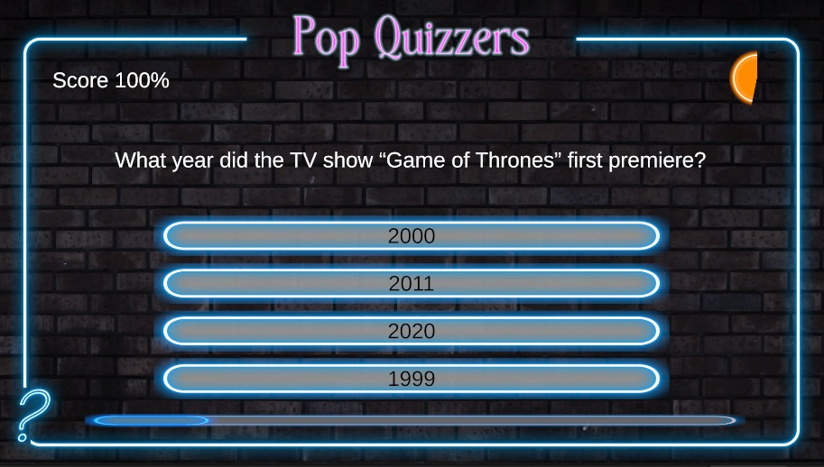

# Quiz Master 🤔

</img>

**Quiz Master** es una aplicación de preguntas y respuestas interactiva desarrollada en Unity, diseñada para desafiar a los jugadores con cuestionarios dinámicos. Ofrece una estructura flexible que permite la personalización de las preguntas.

## Características 📋

- Preguntas de opción múltiple.
- Temporizador para cada pregunta, lo que agrega un elemento de presión.
- Sistema de puntuación automática.
- Fácil integración de nuevas preguntas a través de un diseño modular.
- Interfaz gráfica intuitiva y adaptable.

## Instalación y Uso 🛠️

1. Clona el repositorio en tu máquina local:

   ```bash
   git clone https://github.com/danielmaavre/Quiz-Master.git


2. Abre el proyecto en Unity (recomendado usar la versión 2022.3 o superior).

    Ejecuta la escena principal para comenzar a jugar.

3. Uso 🕹️

- El jugador selecciona la respuesta correcta entre varias opciones antes de que el temporizador se agote.
- Al final del cuestionario, se muestra la puntuación obtenida.


## Contribuciones 🤝

Actualmente el juego cuenta con 5 preguntas de 4 posibles respuestas!

¡Las contribuciones son bienvenidas! Si deseas mejorar el juego o añadir nuevas características, por favor abre un issue o envía un pull request.
